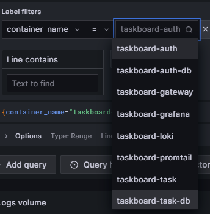
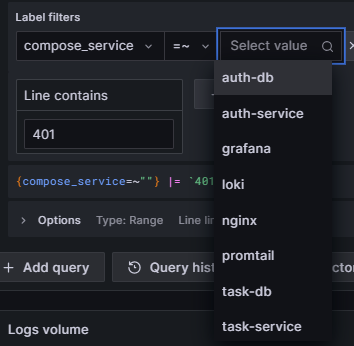

# engse207-termproject-jwt-microservices

### 📊 สรุปผลการทดสอบ

กรอกตารางนี้หลังทำ Test Cases ครบ:

| Test Case | Expected | Actual | ✅/❌ | หมายเหตุ |
|-----------|----------|--------|------|---------|
| 1. ไม่มี Token | 401 | | | |
| 2. Login สำเร็จ | 200 + Token | | | |
| 3. มี Token ถูกต้อง | 200 + data | | | |
| 4. Token Invalid | 401 | | | |
| 5. Forbidden (403) | 403 | | | |
| 6. Admin access | 200 | | | |
| 7. Rate Limit | 429 | | | |
| 8. SQL Injection | Safe | | | |


### 5.4 วิธีดู Logs ใน Grafana

```
1. เปิด http://localhost:3030  (Grafana)
2. Login: admin / admin
3. ซ้ายบน → Explore (icon กล้อง)
4. เลือก datasource: Loki
5. ใส่ LogQL query:
```

**Query ที่มีประโยชน์สำหรับ Security:**




**Queryที่อาจารย์ให้มา ✅ใช้ได้/❌ใช้ไม่ได้**
```logql
# ดู logs ทั้งหมดจาก auth-service
{container_name="task-board-security-auth-service-1"} ❌ เพราะชื่อcontainer ไม่ตรง


# ดู failed login
{container_name=~".*auth.*"} |= "Login failed"✅

# ดู 401 errors
{container_name=~".*task.*"} |= "401"✅

# ดู requests ทุกอย่าง
{compose_service=~"auth-service|task-service|user-service"}✅

# กรองเฉพาะ error
{compose_service="task-service"} |= "ERROR" | logfmt ✅

```
